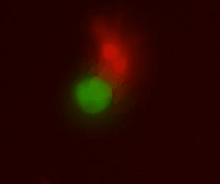

Nestled within the corn fields of Iowa, we explore stem cells in the respiratory system and the signals that instruct their behavior and function. Our goal is to leverage the knowledge we gain during our scientific exploration to develop future repair strategies to heal the diseased lung.

We welcome you to explore our pages to learn more about who we are and what excites us in the lab.

The Jones Lab opens this August at the University of Iowa and is recruiting at all levels.

lung fibroblasts (red) interacting with a basal cell organoid (green)
