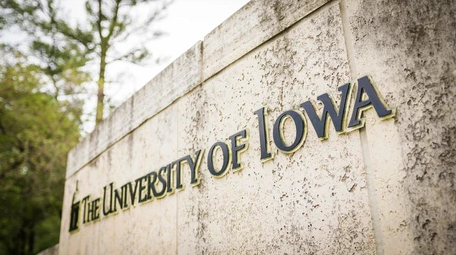

Our laboratory is part of the [Department of Anatomy and Cell Biology](https://acb.medicine.uiowa.edu/) within the [Carver School of Medicine](https://medicine.uiowa.edu/). We are located on the first floor of the Bowen Science Building.

We are always on the lookout for talented and curious scientists from a wide range of backgrounds, including stem cell biology, biomedical engineering, cellular/molecular biology, bioinformatics, physiology, and similar fields.

**Prospective graduate students**: Please contact [Dakota](mailto:dakota-jones@uiowa.edu) to arrange a meeting to discuss your interests and the research in the lab. 

**Prospective postdocs**: Please contact [Dakota](mailto:dakota-jones@uiowa.edu) with your CV and a brief explanation of your research interests/accomplishments and why you're interested in joining the laboratory.

**Email:** dakota-jones@uiowa.edu

**Mail**

