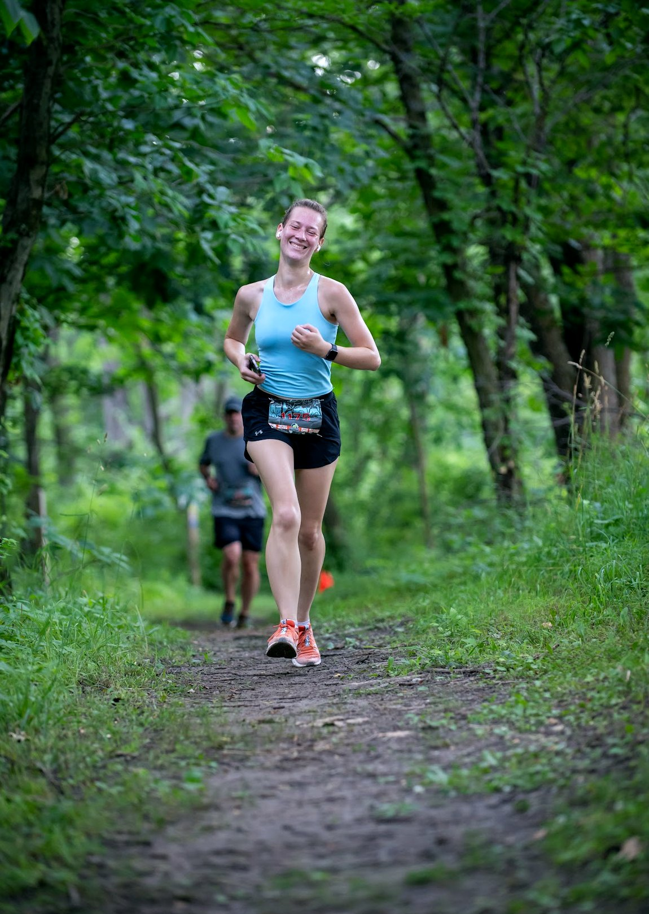
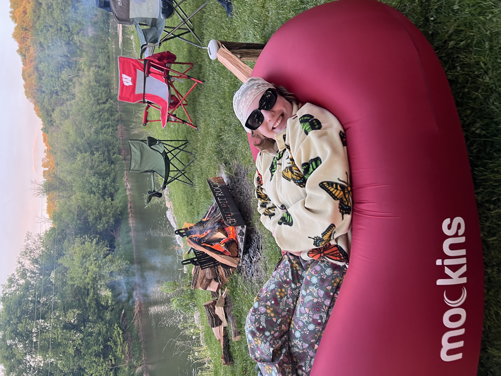

 

<!-- DAKOTA -->

  

    
    
  

  

    <strong>Dakota Jones, PhD</strong> 
    <em>Principal Investigator</em>  
    Assistant Professor 
    Department of Anatomy and Cell Biology 
    Carver College of Medicine 
    University of Iowa
  

<!-- ELLYSE -->

  

    
    
  

  

    <strong>Ellyse Froehlich</strong> 
    <em>Postbac</em>
  

<!-- ABBY -->

  
  

    <strong>Abby McLeod</strong> 
    <em>Research Assistant</em>
  

<!-- JOCELYN -->

  

    
    
  

  

    <strong>Jocelyn Riley</strong> 
    <em>Graduate Student</em>
  

<!-- BRUCE -->

  

    
    
  

  

    <strong>Bruce Warmann</strong> 
    <em>Graduate Student</em>
  

<!-- YUN -->

  

    
    
  

  

    <strong>Yeo Gyun Yun, PhD</strong> 
    <em>Postdoctoral Fellow</em>
  

<!-- WEIHONG -->

  
  

    <strong>Weihong Zhou</strong> 
    <em>Lab Manager</em>
  

